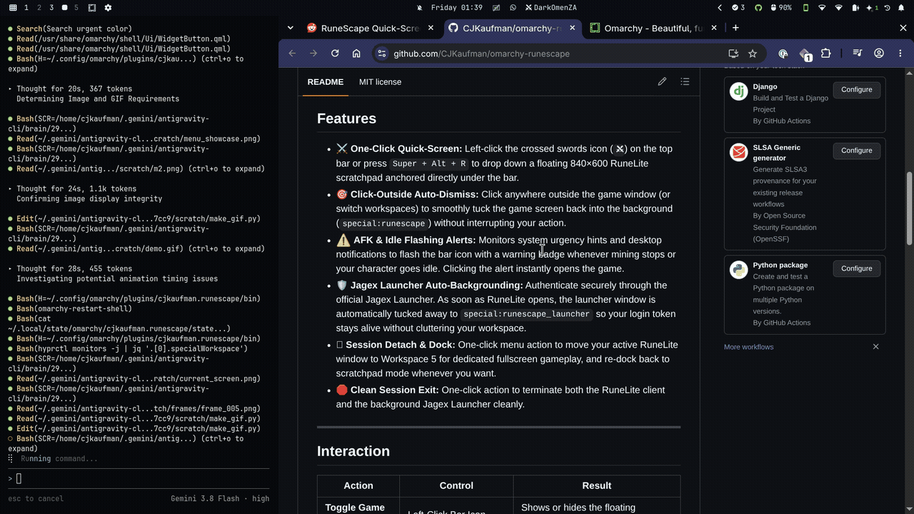
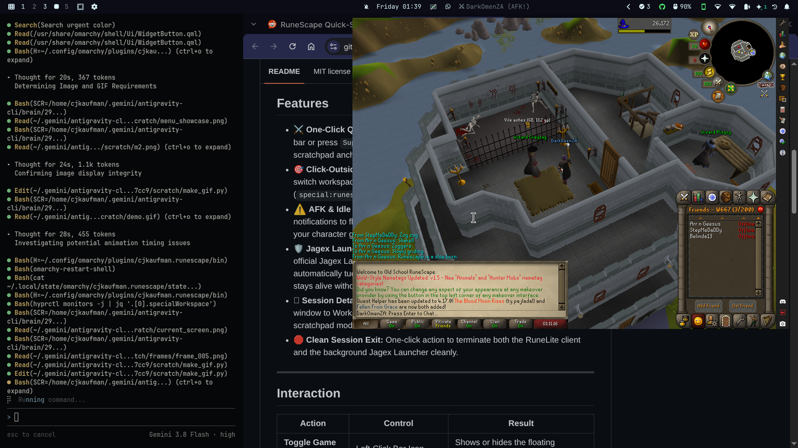
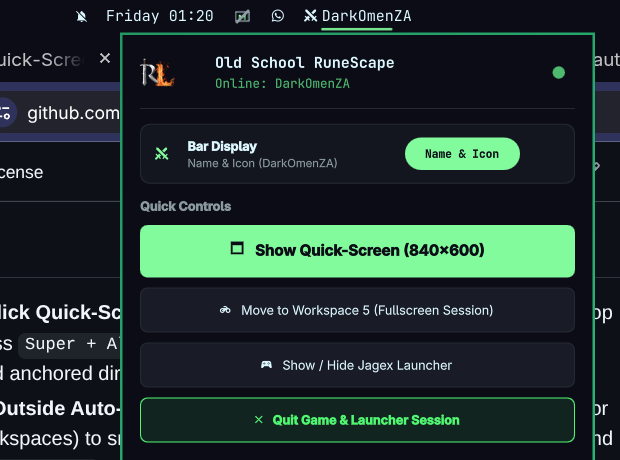

# RuneScape Quick-Screen for Omarchy

A native Omarchy top-bar applet and floating scratchpad controller for Old School RuneScape (OSRS / RuneLite). Designed for seamless AFK skilling (mining, woodcutting, fishing, combat) while working, browsing, or coding.

<p align="center">
  
</p>

## Showcase

| Quick-Screen Floating Overlay | Quick Controls & Display Toggle |
|:---:|:---:|
|  |  |

---

## Features

- ⚔️ **One-Click Quick-Screen:** Left-click the crossed swords icon (`󰞇`) on the top bar or press `Super + Alt + R` to drop down a floating 840×600 RuneLite scratchpad anchored directly under the bar.
- 🎯 **Click-Outside Auto-Dismiss:** Click anywhere outside the game window (or switch workspaces) to smoothly tuck the game screen back into the background (`special:runescape`) without interrupting your action.
- ⚠️ **AFK & Idle Flashing Alerts:** Monitors system urgency hints and desktop notifications to flash the bar icon with a warning badge whenever mining stops or your character goes idle. Clicking the alert instantly opens the game.
- 🛡️ **Jagex Launcher Auto-Backgrounding:** Authenticate securely through the official Jagex Launcher. As soon as RuneLite opens, the launcher window is automatically tucked away to `special:runescape_launcher` so your login token stays alive without cluttering your workspace.
- 🗖 **Session Detach & Dock:** One-click menu action to move your active RuneLite window to Workspace 5 for dedicated fullscreen gameplay, and re-dock back to scratchpad mode whenever you want.
- 🛑 **Clean Session Exit:** One-click action to terminate both the RuneLite client and the background Jagex Launcher cleanly.

---

## Interaction

| Action | Control | Result |
|---|---|---|
| **Toggle Game Screen** | Left-Click Bar Icon | Shows or hides the floating RuneLite scratchpad |
| **Quick Menu** | Right-Click Bar Icon | Opens in-game controls, launcher controls, and session exit |
| **Global Shortcut** | `Super + Alt + R` | Instant toggle shortcut anywhere in Hyprland |
| **Dismiss Screen** | Click Outside / Change Workspace | Auto-hides scratchpad back to background |

---

## Dependencies & Requirements

- **Omarchy Linux** (Hyprland Wayland compositor + Quickshell)
- **Python 3.10+** (with `socket`, `select`, `subprocess`, `json` standard libraries)
- **`hyprctl`** (included by default in Omarchy)
- **RuneLite** or **Jagex Launcher** AppImage / Flatpak:
  - Official Jagex Launcher AppImage in `~/Downloads` or `~/.local/share/Jagex Launcher`
  - RuneLite AppImage in `~/.local/share/Jagex Launcher/games/runelite/` or on `PATH`

---

## Installation

### Via Omarchy Marketplace / CLI (Recommended)

```bash
omarchy plugin add https://github.com/CJKaufman/omarchy-runescape --enable
```

### Manual Git Installation

```bash
git clone https://github.com/CJKaufman/omarchy-runescape \
  ~/.config/omarchy/plugins/cjkaufman.runescape

omarchy plugin enable cjkaufman.runescape
omarchy restart shell
```

---

## Hyprland Configuration (Recommended)

To ensure the game window floats perfectly under the bar on the `special:runescape` workspace, add the following rules:

### Window Rules (`~/.config/hypr/hyprland.lua`)

```lua
-- RuneLite OSRS game client popup scratchpad
o.window({ class = "^(net-runelite-launcher-Launcher)$" }, { float = true, size = { 840, 600 }, move = { 680, 34 }, workspace = "special:runescape" })

-- Jagex Launcher login window
o.window({ class = "^(jagex-launcher)$" }, { float = true, center = true, size = { 800, 600 } })
```

### Global Toggle Shortcut (`~/.config/hypr/bindings.lua`)

```lua
o.bind("SUPER + ALT + R", "RuneScape Quick-Screen", (os.getenv("HOME") or "") .. "/.local/bin/runescape-toggle")
```

### Autostart Daemon (`~/.config/hypr/autostart.lua`)

```lua
o.launch_on_start((os.getenv("HOME") or "") .. "/.config/omarchy/plugins/cjkaufman.runescape/bin/runescape-helper daemon")
```

---

## Settings

Configurable via Omarchy shell settings or `~/.config/omarchy/shell.json`:

| Setting | Type | Default | Description |
|---|---|---|---|
| `popupWidth` | integer | `840` | Width of the floating game popup window (px) |
| `popupHeight` | integer | `600` | Height of the floating game popup window (px) |
| `autoHideOnBlur` | boolean | `true` | Auto-dismiss game screen when clicking outside |
| `flashOnAlert` | boolean | `true` | Pulsing animation on top-bar icon during AFK alerts |
| `showCharacterName` | boolean | `true` | Display character name alongside icon, or icon-only mode |

---

## Removal & Uninstallation

```bash
omarchy plugin disable cjkaufman.runescape
omarchy plugin remove cjkaufman.runescape
```

To clean up local runtime state:
```bash
rm -rf ~/.local/state/omarchy/cjkaufman.runescape
```

---

## License

[MIT](LICENSE) © 2026 Carl Kaufman
